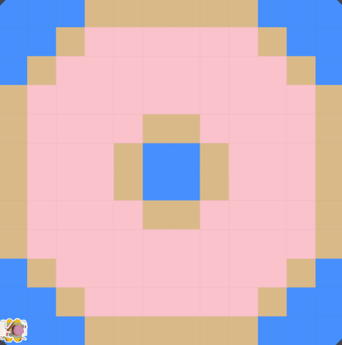

# Asphalt-Art-Project
# Unit 1 - Asphalt Art

## Introduction

Cities use asphalt art to improve public safety, inspire their residents and visitors, and brighten communities. Your goal is to create asphalt art to revitalize The Neighborhood and bring the community together with the help of the Painter.

## Requirements

Use your knowledge of object-oriented programming, algorithms, the problem solving process, and decomposition strategies to create asphalt art:
- **Create a new subclass** – Create at least one new subclass of the PainterPlus class that is used for a component of the asphalt art design.
- **Plan an algorithm** – Use the problem solving process and decomposition strategies to plan an algorithm that incorporates a combination of sequencing, selection, and/or iteration.
- **Write a method** – Write at least one method in a PainterPlus subclass that contributes to a component of the asphalt art design.
- **Document your code** – Use comments to explain the purpose of the methods and code segments.

## Notes: Neighborhood & Painter Class

This project was created on Code.org's JavaLab platform using the built-in Neighborhood GUI output. To test and edit this project you must build in Code.org's JavaLab with the Neighborhood GUI enabled. For reference to the Painter class documentation, [you can read more here.](https://studio.code.org/docs/ide/javalab/classes/Painter)

## Output:

## Reflection

1. Describe your project.

   - I decided to create an image of a donut. Using Code.org I created 3 or 2 more classes/painters to create this image. And using those various painters, they created my pink glazed donut. I chose a pink glazed donut because of how familiar that pink circular desert is.

2. What are two things about your project that you are proud of?

   - Two thinks about my project that I'm proud of is that the crust/dough/brown parts of the donut had worked so well. I'm also how well coloring all of the donut's glaze was able to work so well.

3. Describe something you would improve or do differently if you had an opportunity to change something about your project.

   - Something I would improve or do differently is adding more if statements into my coding, along with true or false methods. I would also want to add another painter for the painting sprinkles on the donut.